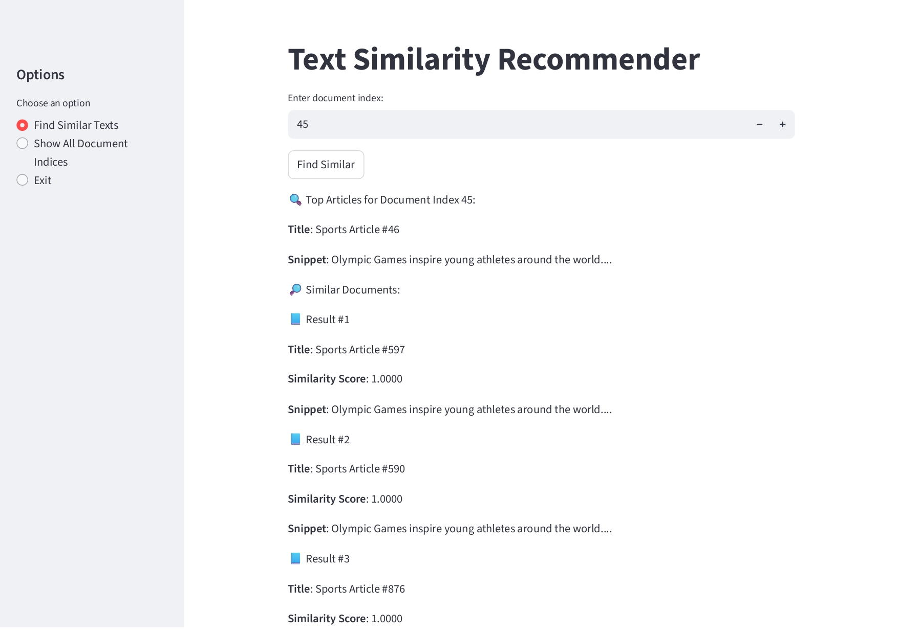

# 📘 Text Similarity Recommender App

A **Streamlit web app** for text similarity analysis.  
This app uses **TF-IDF + Cosine Similarity** to recommend related texts from a dataset, with features like visualization, CSV export, and category previews.

---

## 🚀 Features
- 📝 Text preprocessing (lowercasing, punctuation/number removal, tokenization, lemmatization, stopword removal).  
- 📊 Builds TF-IDF matrix with unigrams & bigrams.  
- 🔍 Finds **Top-K most similar documents** using cosine similarity.  
- 📈 Interactive bar chart of similarity scores.  
- 📂 CSV export of recommendations.  
- 🎛 Sidebar UI for choosing options (Find Similar, Show All Documents, Exit).  

---

## 📂 Project Structure
```text
├── app.py                               # Main Streamlit application
├── requirements.txt                     # Dependencies
├── Text_Similarity_Dataset_with_Categories.csv  # Dataset
└── README.md                            # Project documentation
```
## Run Locally

### 1️⃣ Clone the repo
```bash
git clone https://github.com/MrDivyanshAgrawal/text-similarity-app.git
cd text-similarity-app
```
### 2️⃣ Install dependencies
```bash
pip install -r requirements.txt
```

### 3️⃣ Run the app
```bash
streamlit run app.py
```

➡ Open http://localhost:8501 in your browser 🎉

## 🛠 Requirements
Python 3.9+
streamlit
nltk
pandas
scikit-learn
matplotlib

## 📊 Usage Example
- Select **Find Similar Texts** from the sidebar.  
- Enter a document index (e.g., 0).  
- Click **Find Similar** → view top recommendations with similarity scores.  
- View interactive bar chart of scores.  
- Export results to CSV if needed.  

## 📷 Screenshots



## 👨‍💻 Author
Divyansh Agrawal Built with ❤️ using [Streamlit](https://streamlit.io). 
